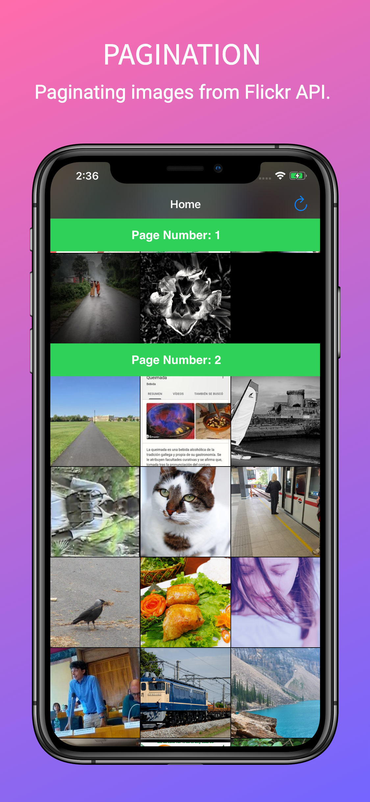
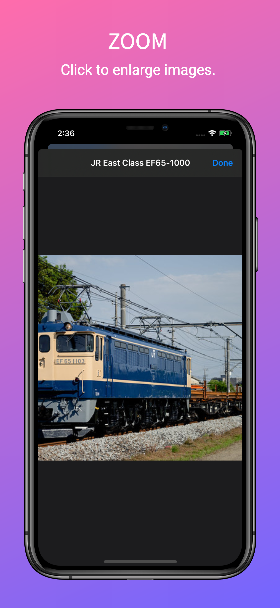

# Flickr Client

The app fetches random images from flickr API and display them in a UICollectionView with pagination and also stores them offline with the help of Core Data.  

## Screenshots
  &nbsp; &nbsp;  &nbsp; &nbsp; 

## Requirements
1. Xcode 11
2. Swift 5
3. iOS 13

## License
This code is free and open source and I have build this project for my udacity submission.
